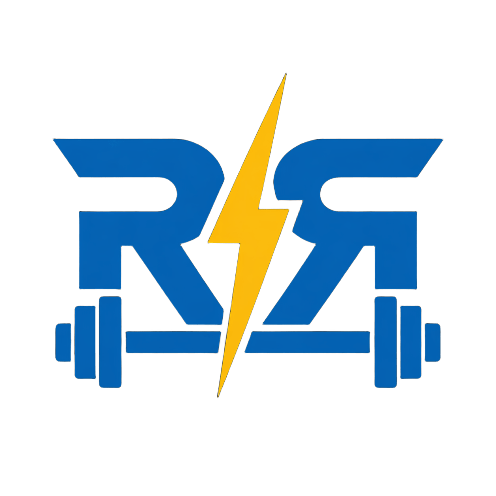

<p align="center">
  
</p>

<h1 align="center">RepRush</h1>

<p align="center">
  <strong>RepRush</strong> is a high-performance Android application designed for fitness enthusiasts who want to track their gym progress with precision and a touch of gamification. Built with a modern Android stack, it bridges the gap between raw data and rewarding achievement.
</p>

---

## 🚀 Vision
To empower athletes to exceed their limits through consistent tracking, insightful analytics, and a competitive edge provided by global leaderboards and personal achievements.

## ✨ Key Features
- **Smart Workout Logging**: Log exercises, sets, and reps with a clean, focus-oriented UI.
- **Progressive Overload Analytics**: Visualize your strength gains with interactive charts powered by **MPAndroidChart**.
- **Social Gamification**: Compete on global leaderboards and earn unique badges for hitting milestones.
- **Offline-First Architecture**: Train anywhere. Your data is synced automatically from **Room** to **Firebase Firestore** once you're back online.
- **Secure and Personalized**: Integrated with **Google Sign-In** for seamless, secure access to your profile across devices.

---

## 🛠 Tech Stack
RepRush is built using the latest industry standards for reliability and performance:
- **Language**: Kotlin 2.3.21
- **Architecture**: MVVM with Repository Pattern
- **Dependency Injection**: Hilt 2.59.2
- **Persistence**: Room (Local) & Firebase Firestore (Remote)
- **UI Framework**: XML Layouts with Material 3 & ViewBinding
- **Concurrency**: Kotlin Coroutines & Flow
- **Analytics**: MPAndroidChart
- **Networking/Sync**: Firebase Auth & Google Play Services

---

## 📂 Project Structure
```text
com.reprush.app
├── data
│   ├── local        # Room Database, DAOs, and Entities
│   └── remote       # Firebase & Network services
├── repository       # Truth source for data coordination
├── ui               # Fragments and ViewModels organized by feature
│   ├── auth         # Login and Registration
│   ├── home         # Dashboard and Overview
│   ├── workout      # Active session and Exercise logs
│   ├── progress     # Charts and Statistics
│   └── profile      # User settings and Badges
├── di               # Hilt Modules
└── util             # Extension functions and Helpers
```

---

## 🗺 Documentation
The core project documentation can be found in the [`.plan`](./.plan) folder:
- [**Product Requirements (PRD)**](./.plan/01_PRD.docx)
- [**Database Schema**](./.plan/02_Database_Schema.docx)
- [**Feature Scope**](./.plan/04_Scope_Feature_List.docx)

---

*RepRush v1.0 | April 2026*
